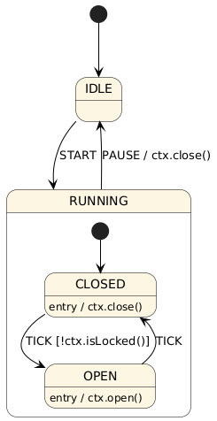

# MicroHSM: Embedded Hierarchical State Machine (HSM) Library


A lightweight, but powerful embedded-friendly C++ library implementing UML-compliant hierarchical
state machines.

---

## Table of Contents

- [Features](#features)
- [Hierarchical State Machines](#hierarchical-state-machines)
- [Including microhsm in your project](#including-microhsm-into-your-project)
- [How to create and use MicroHSM](#how-to-create-and-use-microhsm)
- [Examples](#examples)

---

## Features

- **UML-complicant semantics**, including:
    - ✅ Hierarchy
    - ✅ External, local and internal transitions
    - ✅ Transition guards and effects
    - ✅ Entry and exit actions
    - ✅ Anonymous transitions
    - ✅ Shallow and deep history

- **Run-to-completion event dispatcher** - Ensures determinism
- **Small memory footprint** - Simple and efficient
- **No use of dynamic memory** - Static memory only
- **No use of C++ standard library** - Ideal for bare-metal
- **Build as static libary or include directly** - Integrate in any project
- **Lightweight** - Core library consists of less than 300 lines of code
- **Zero dependencies** - Library is fully self-contained and does not rely on external libraries
- **Tracing functionality** - Trace the transitions that your HSM takes

---

## Hierarchical State Machines ⚙️

A Hierarchical State Machine (HSM) is a behavioral modeling construct that extends
traditional finite state machines (FSMs) with support for nested (hierarchical) states.
In an HSM, states can be organized in a tree-like structure where a superstate can
contain one or more substates. This enables powerful reuse of behavior,
reduces redundancy, and simplifies complex state models.

HSMs follow formal semantics defined by the UML (Unified Modeling Language) State Machine specification,
supporting features like:

- Inheritance of behavior through superstates
- Entry/exit actions for encapsulating state-related behavior
- History mechanisms to remember previous substates
- Guard conditions and transition effects for decision logic

### Why use Hierarchical State Machines (HSMs)

While small state-based logic can be implemented using `switch`/`case` statements or simple
function pointers, this approach quickly breaks down as the system grows in complexity.
Such `switch`/`case` statements can quickly get out of hand and their behavior cannot be
easily understood from just looking at the code.

- Maintainability - HSMs can create cleaner code as shared behavior can be implemented once in a composite-state instead of copied across multiple states.
- Readability - visual HSM diagrams can provide an immediate intuitive understanding of system behavior. Furthermore, these diagrams can be read by programmers and non-programmers alike.
- Encapsulation - behavior can be more easily encapsulated in a single state by using entry and exit behaviors.
- Determinism - HSMs enforce a highly deterministic control flow for states and events. This makes your system more predictable and reliable.

---

# Including microhsm into your project

1. Clone the library into your preferred directory:
- `cd myproject/thirdparty/`
- `git clone https://github.com/Jellycious/microhsm`

2. Include microhsm directory and link to it:
- In your CMakeLists.txt file:
```
add_subdirectory(myproject/thirdparty/microhsm)

target_link_libraries(myproject PRIVATE microhsm)
```

3. (Optional) Include custom configuration:
- Create microhsm\_config.hpp header file:
```
// file: 'myconfig/microhsm_config.hpp'

// Enable assertions and provide hook
#define MICROHSM_ASSERTIONS 1

#include <assert.h>
#define MICROHSM_ASSERT(expr) assert(expr)
```
- Include header file in your CMakeLists.txt
```
// Tell microhsm to compile with custom config
add_compile_options(
    -DMICROHSM_CUSTOM_CONFIG
)

// Add header file to microhsm target
target_include_directories(microhsm PRIVATE
    myproject/myconfig
)
```

---

# How to create and use MicroHSM

One can define state machines in two different ways:

- Option 1 - Defining states and HSMs manually:

> Create your HSMs by creating your own HSMs and state classes that inherit from the
> `BaseHSM` and `BaseState` classes.

- Option 2 - Defining states and HSMs through the use of macros (recommended):

> Define your HSMs using a set of expressive macros. This approach offers a more concise and readable syntax,
> significantly reducing boilerplate code. While it abstracts away
> some implementation details, it streamlines development and improves maintainability for most use cases.

The next examples will show both methods respectively.

## Vertex and Event IDs
Every vertex and event should have a unique ID associated to it.
```
// Vertex IDs
enum eValveState : unsigned int {
    eSTATE_IDLE = 0,
    eSTATE_RUNNING,
    eSTATE_CLOSED,
    eSTATE_OPEN,
    eSTATE_COUNT
};

// Event IDs
enum eValveEvent : unsigned int {
    eEVENT_ANONYMOUS = 0, // Reserved event ID 0 for anonymous events
    eEVENT_START,
    eEVENT_TICK,
    eEVENT_PAUSE,
};
```

or alternatively with macros:

```
HSM_CREATE_VERTEX_LIST(eValveState,
    eSTATE_IDLE,
    eSTATE_RUNNING,
    eSTATE_CLOSED,
    eSTATE_OPEN,
    eSTATE_COUNT
)
HSM_CREATE_EVENT_LIST(eValveEvent,
    eEVENT_START,
    eEVENT_PAUSE,
    eEVENT_TICK
)
```

## State declarations
```
// Declare a top-level state
class StateRunning : public microhsm::BaseState
{
    public:
        StateRunning(microhsm::BaseState* initialState) : microhsm::BaseState(
                eSTATE_RUNNING,     // ID of `StateRunning`
                nullptr,            // Pointer to parent state of `StateRunning` (`nullptr` because no parent)
                initialState)       // Pointer to initial state of `StateRunning`
        {
        };

        bool match(unsigned int event, microhsm::sTransition* t, void* ctx) override;
};

// Declare a state with a parent
class StateOpen : public microhsm::BaseState
{
    public:
        StateOpen(StateRunning* parentState) : microhsm::BaseState(
                eSTATE_OPEN,        // ID of `StateOpen`
                parentState,        // Pointer to parent state of `StateOpen`
                nullptr)            // Pointer to initial state of `StateOpen`
        {
        };

        bool match(unsigned int event, microhsm::sTransition* t, void* ctx) override;

        // Optional entry function
        void entry(void* ctx) override;
};
```

or alternatively with macros:

```
HSM_DECLARE_STATE_TOP_LEVEL(StateRunning, eSTATE_RUNNING)
HSM_DECLARE_STATE(StateClosed, eSTATE_CLOSED, StateRunning,
        HSM_DECLARE_STATE_ENTRY()
)
```

or alternatively

```
HSM_DECLARE_STATE_TOP_LEVEL(StateRunning, eSTATE_RUNNING)
```

## HSM declaration

Then we declare the HSM itself.

```
class ValveHSM : public microhsm::BaseHSM
    {
        public:
            /*
             * The constructor of `ValveHSM`
             * provides the initial state to the `BaseHSM`.
             */
            ValveHSM() : microhsm::BaseHSM(state_idle) {}

            /* Required functions */
            microhsm::Vertex* getVertex(unsigned int ID) override;
            unsigned int getMaxID(void) override;

        private:

            /* States */
            StateIdle state_idle = StateIdle(nullptr);                          // Constructor argument is the initial state (`nullptr` here, because state has no children)
            StateRunning state_running = StateRunning(&state_closed);           // Constructor argument is the initial state
            StateOpen state_open = StateOpen(&state_running, nullptr);          // Constructor arguments are parent state and initial state respectively
            StateClosed state_closed = StateClosed(&state_running, nullptr);    // Constructor arguments are parent and initial state respectively
    };
```

## Implement required HSM functions

For every HSM it is required to add two functions. These are used by the dispatcher to perform transitions.

```
// Should return the highest possible vertex ID
unsigned int ValveHSM::getMaxID()
{
    // Here we simply return the highest possible ID for a state
    return static_cast<unsigned int>(eSTATE_COUNT) - 1;
}

// Should return vertex associated to an ID
microhsm::Vertex* ValveHSM::getVertex(unsigned int id)
{
    // In this case modelled as a simple switch case
    switch(id) {
        case eSTATE_IDLE: return &this->state_idle;
        case eSTATE_RUNNING: return &this->state_running;
        case eSTATE_OPEN: return &this->state_open;
        case eSTATE_CLOSED: return &this->state_closed;
        default: return nullptr;
    }
}
```

## Implement state transitions

Every state requires a `match` function. The match function should match events to transitions and possibly check any guards.
If a `match` function returns `false` then the event has not matched a transition, if the `match` function has returned `true`,
then a transition was matchd and the transition object `t` must be evaluated by the dispatcher.

In the `match` function you can make use of the following functions:

- `noTransition()`: No transition matched (simply returns `false`)
- `transitionExternal(targetID, transition, effect)`: External transition matched
- `transitionLocal(targetID, transition, effect)`: Local transition matched
- `transitionInternal(targetID, transition, effect)`: Internal transition matched

```
bool StateClosed::match(unsigned int event, microhsm::sTransition* t, void* ctx)
{
    ValveContext* valve = static_cast<ValveContext*>(ctx);
    // Define transition table
    switch(event) {
        case eEVENT_TICK:
            // Guards must be implemented manually by checking them in the `match` function.
            if (!valve->isLocked()) {
                // Transition from `StateClosed` to `StateOpen`, if guard valve->canOpen succeeds.
                return transitionExternal(eSTATE_OPEN, t, nullptr);
            }
            break;
        default:
            break;
    }
    return noTransition();
}
```

The match function can also be implemented using a macro:

```
HSM_DEFINE_STATE_MATCH(StateClosed)
{
    ValveContext* valve = static_cast<ValveContext*>(ctx);
    // Define transition table
    switch(event) {
        case eEVENT_TICK:
            // Guards must be implemented manually by checking them in the `match` function.
            if (!valve->isLocked()) {
                // Transition from `StateClosed` to `StateOpen`, if guard valve->canOpen succeeds.
                return transitionExternal(eSTATE_OPEN, t, nullptr);
            }
            break;
        default:
            break;
    }
    return noTransition();
}
```

## Last step: initializing HSM and dispatching events

```
// Initialize HSM
ValveCTX ctx = ValveCTX(); // An context object
ValveHSM hsm = ValveHSM();
// Dispatch event to HSM
microhsm::eStatus s = hsm.dispatch(eEVENT_TICK, static_cast<void*>(ctx));
/*
* `s` can be three possible values
* `eOK`                 - event matched and transition taken
* `eEVENT_IGNORED`      - event not matched and ignored
* `eTRANSITION_ERROR`   - critical error
*/
assert(s != eTRANSITION_ERROR);
```

---

# Examples
In `microhsm/example` you will an example of a Hierarchical State Machine.
The HSM is a model of a trickle Valve that opens and closes repeatedly. The valve can
be locked by an external command. When this is done, it is not allowed to go to the
open state. Furthermore, it is possible to pause the valve which will make it close itself
and ignore commands until the next start event.



The example contains do different implementations of the same HSM. One implementation makes use of
regular C++ syntax, while the other implementation makes heavy use of macros.
Using macros reduce boilerplate code at the cost of hiding implementation details.
Both methods offer the same expressiveness. The choice is mostly personal preference.

### Example Features

The examples make use of the following HSM features:

- State hierarchy
- Transition effects
- External transitions
- Entry behavior
- Transition guards
- Context object

### Context Object

The example also shows how a context object may be passed to the HSM. The libary has no knowledge
of the context object and simply passes it to user-defined functions as a void pointer.
One has access to this object in the `match`,`entry` and `exit` functions. Context objects are generally used to provide a
communication layer between the HSM and the rest of the application. One can methods and access the
context data during the `entry` and `exit` behaviors. In the example, this is used to open/close the valve upon
entering the open and closed states.

See the following code snippet:

```
/*
 * One has access to the following parameters in the `entry` function:
 * - `void* ctx`: The context object
 */
HSM_DEFINE_STATE_ENTRY(StateOpen)
{
    // We use a context object to open the valve
    ValveContext* context = static_cast<ValveContext*>(ctx);
    context->open();
}
HSM_DEFINE_STATE_EXIT(StateOpen)
{
    // Similar to state enty, but for state exit
}
```

Another usecase is for implementing guards. It is up to the implementor
to check guards appropriately in the `match` function of a state. In the example the HSM may only move to the
open state if the valve is not locked. This is achieved in the following manner:

```
/*
 * One has access to the following parameters in the `match` function:
 *
 * - 'unsigned int event`: Event that needs to be matched against transitions
 * - `microhsm::sTransition* t`: Transition object (modified to reflect type of transition)
 * - `void* ctx`: Context object
 */
HSM_DEFINE_STATE_MATCH(StateClosed)
{
    // We obtain the context object
    ValveContext* valve = static_cast<ValveContext*>(ctx);
    // Define transition table
    switch(event) {
        case eEVENT_TICK:
            // We use the context object to implement a transition guard.
            if (!valve->isLocked()) {
                // Transition from `StateClosed` to `StateOpen`, if guard: `!valve->isLocked()` succeeds.
                return transitionExternal(eSTATE_OPEN, t, nullptr);
            }
            break;
        default:
            break;
    }
    // We return `noTransitions` in case we did not match an event
    return noTransition();
}
```

A little trick is to use non-capturing lamdbdas and pass this to a transition as the effect function.
This allows you to combine multiple actions into a single effect. The reason to use non-capturing lambdas
is that this prevents any dynamically memory from being allocated, making it embedded-friendly.

```
HSM_DEFINE_STATE_MATCH(SomeState) {

    auto combinedEffect = [](void* ctx) {
        ValveCTX* ctx = static_cast<ValveCTX*>(ctx);
        ctx->effect1();
        ctx->effect2();
    };

    switch(event) {
        case eEVENT_TICK:
            // When this transition is taken `ValveCTX::effect1` and `ValveCTX::effect2` will be called in order.
            return transitionExternal(eSOME_STATE, t, combinedEffect);
        default:
            break;
    }

    return noTransition();
}
```

## Custom configuration options (microhsm\_config.hpp)

### MICROHSM\_ASSERTIONS

When set `MICROHSM_ASSERTIONS` is defined to be `1` microhsm will verify certain conditions regarding the HSM
structure. It will also do additional checks during event dispatching

To asser the user has to provide its own `MICROHSM_ASSERT(expr)` hook. This
hook gets called with expressions which require asserting. If an expr evaluates
to false, there is an critical issue.

### MICROHSM\_TRACING

When set to `MICROHSM_TRACING` is defined to be `1` microhsm will call special hooks during the event dispatching.
This can be used to verify and debug you HSMs. One has to provide several hooks
that will be called during event matching and taking of transitions.

The hooks that should be implemented are

- `MICROHSM_TRACE_ENTRY(id)` - Called upon entering a state
- `MICROHSM_TRACE_EXIT(id)` - Called upon exiting a state
- `MICROHSM_TRACE_DISPATCH_IGNORED(event)` - Called when an event was ignored by HSM
- `MICROHSM_TRACE_DISPATCH_MATCHED(event, id)` - Called when an event matched a transition on a state

